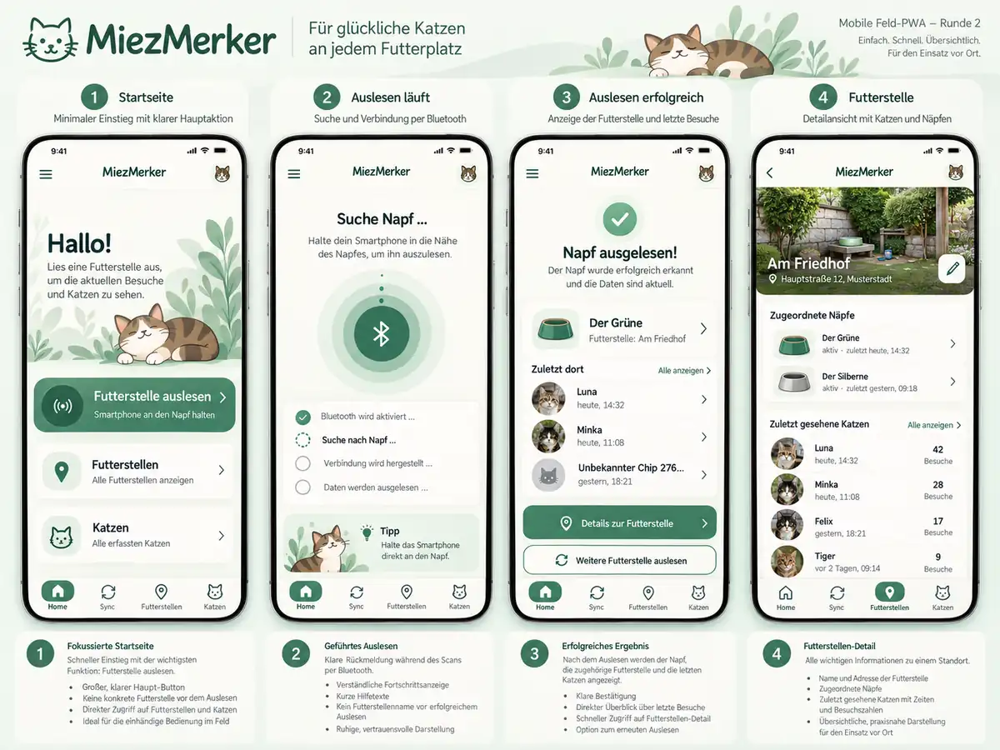

# MiezMerker Feld-PWA – freigegebene Designrichtung (Mockup-Runde 2)

Status: **Produkt-/UX-Richtung gemeinsam abgestimmt am 2026-10-08**, keine pixelgenaue Implementierungsvorgabe.
**Freigegebenes Mockup (Runde 2): [Bildansicht (WebP)](./round-2-approved-mockup.webp)** – direkt aus der im Chat abgenommenen Bildserie als weboptimierter Export, dauerhaft im Repository abgelegt. Optionales [schematisches Wireframe (SVG)](./round-2-wireframe.svg) zur Referenz von Screenstruktur und Informationshierarchie. Farben, Zahlen, Zeitstempel, Tierbilder und Ortsnamen der Mockups sind **Beispiel-/Dummywerte** und dürfen nicht als verfügbare Echtdaten interpretiert werden.

## Freigegeben

1. **Bottom Navigation** auf mobilen Geräten: Home, Sync, Futterstellen, Katzen; erkennbare aktive Sektion, ausreichend große Touch-Ziele, Safe-Area-Inset, Daumenreichweite, kein Hamburger-Menü für die vier Hauptbereiche. Auf Desktop responsiv adäquate Navigation. Keine vierte Admin-Funktion.
2. **Home vor dem Auslesen ist absichtlich kontextfrei**: großer CTA `Futterstelle auslesen`, sekundäre Zugänge zu Futterstellen und Katzen. **Keine Futterstellenauswahl und keine aktuelle/letzte Futterstelle, kein Napf oder Katzenhistorie als voreingestellter Kontext.** Keine Fantasie-Statistiken.
3. **Sync ist geräte-/napfbezogen, nicht vorab standortbezogen**: nach *expliziter* Web-Bluetooth-Geräteauswahl Napf erkennen, vorhandenen Collector benutzen, Phasen erklären, korrekter Abbruch/Retry/Offline-Zustand.
4. **Nach bestätigtem Auslesen** die Kontextkarte zeigen: benannter Napf (Fallback bei fehlendem Namen), **seine tatsächlich aktuelle Futterstellenzuordnung**, und optional **die letzten N verlässlich dort gesehenen Katzen sowie unbekannten Chips** mit Zeitpunkt/UNKNOWN-Clock. Begrenzte Vorschau, Link auf Futterstellendetail. Unzugeordnet -> klar `Noch keiner Futterstelle zugeordnet`; keine gemutmaßte Futterstelle oder Fake-Daten.
5. **Lokaler Erfolg ist nicht Servererfolg**: `Napf ausgelesen` nur nach dauerhaftem lokaler Übernahme und korrekter BLE-ACK-Semantik. `Daten an Server übertragen` nur nach bestätigtem Upload. Bei Offline/ausstehendem Upload Kontextinformationen nur anzeigen, wenn sie verlässlich lokal vorliegen; keine erzwungene Backend-Abfrage und kein False-Success.
6. **Futterstellendetail**: Name, ggf. tatsächlich vorhandenes Foto/Platzhalter, aktuell zugeordnete benannte Näpfe und zuletzt gesehene Katzen/Chips, geeignete Navigation. Keine Feld-PWA-Bearbeitung/Umhängung von Näpfen oder Futterstellen.
7. **Stil**: MiezMerker-Logo als Branding, sanftes Grün/Türkis/Creme, ruhige Karten, großzügige Abstände, kontrastreich, freundliche illustrative Akzente, mobile-first. Illustrierte Katze und Beispiel-Fotos sind ausdrücklich austauschbare Deko/Dummys, nicht erfundene reale Tier-/Futterstellendaten.

## Technischer Asset-Vertrag für ALLE UI-Issues (#48, #64–#69)

- **Alle Grafiken ohne Eingriff in fachliche Komponenten austauschbar**: Markenlogo, dekorative Hintergründe und Illustrationen, Navigations-/Status-/Action-Icons, Karten-/Napf-/Katzen-Avatare, Futterstellenbilder sowie Empty-State-/Offline-/Fehler-Platzhalter.
- **Zentrale Asset-Referenzen** (z. B. `app/src/assets/` und eine zentrale `assets.ts`-/`assetRegistry`-Zuordnung oder gleichwertiger, klar dokumentierter Ansatz). Semantische Namen statt versions-/dateiformatabhängiger Pfade in Screens.
- **Keine verstreuten** direkten Grafik-URLs/Importpfade, Inline-Base64, Logos als im JSX eingebettete SVG-Pfade oder bildabhängige Business-Logik. Eine zentrale Icon-Abstraktion/Mapping ist zulässig; nicht für jeden Screen individuelle Icon-Hardcodierung. Inline-SVG für rein technische UI-Zeichnung nur, wenn tatsächlich kein auszutauschendes Asset.
- **Austauschprobe**: Mindestens Logo, Home-Illustration, Sync-Icon/Illustration, Default-Katzenavatar und Futterstellen-Platzhalter durch andere Dateien/Zuordnungen ersetzen können, **ohne Home-/Sync-/Site-/Cat-Komponentencode** zu ändern.
- Datengetriebene Katzen-/Futterstellenfotos sind optionale **Daten**, keine behaupteten vorhandenen Backend-Features. Fallbacks aus der zentralen Asset-Registry, keine zufälligen Stock-/Katzenbilder für echte Katzen. Alt-Texte, `aria-hidden` für Dekoration, Größenverhältnisse/`object-fit`, Responsivität und Caching/Offline-Verfügbarkeit beachten.
- Optimierte Web-Assets (SVG/WebP/PNG je Einsatz), keine unnötig großen Bilder im PWA-Bundle; PWA muss offline mit ihren statischen Fallbacks rendern.
- Visual Regression ist hilfreich, aber die **Funktion/Semantik/Barrierefreiheit** hat Vorrang vor einem Pixel-perfect-Klon des Mockups.

## Umsetzungsschnitt

- #64: Bottom Nav, Shell, zentrale Tokens und Asset-Registry/-Adapter.
- #65: Wiederverwendbare Statuskomponenten und semantische Grafiken.
- #48: Login im gemeinsamen Branding, Auth-Gates unverändert.
- #66: reduziertes Home ohne Ortskontext.
- #67: BLE-Flow mit korrekt begrenztem Ergebnis-Kontext nach erfolgreichem Auslesen; unassigned/offline/UNKNOWN states.
- #68: Futterstellenübersicht/-detail und read-only Vorschau; bestehendes #54-Read-Model nutzen.
- #69: Katzen-/Chip-Ansichten, inklusive Default-Avatare und Uhrzeitsemantik.

Korrektheitsgrenzen: Offline-Sync-Gate aus #31, #8 Collector/ACK/Outbox, #53 Provisionierung, ADMIN-only Writes (#51/#52), Tenant-Isolation und historische Site-Attribution erhalten.
