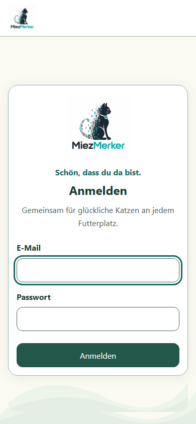
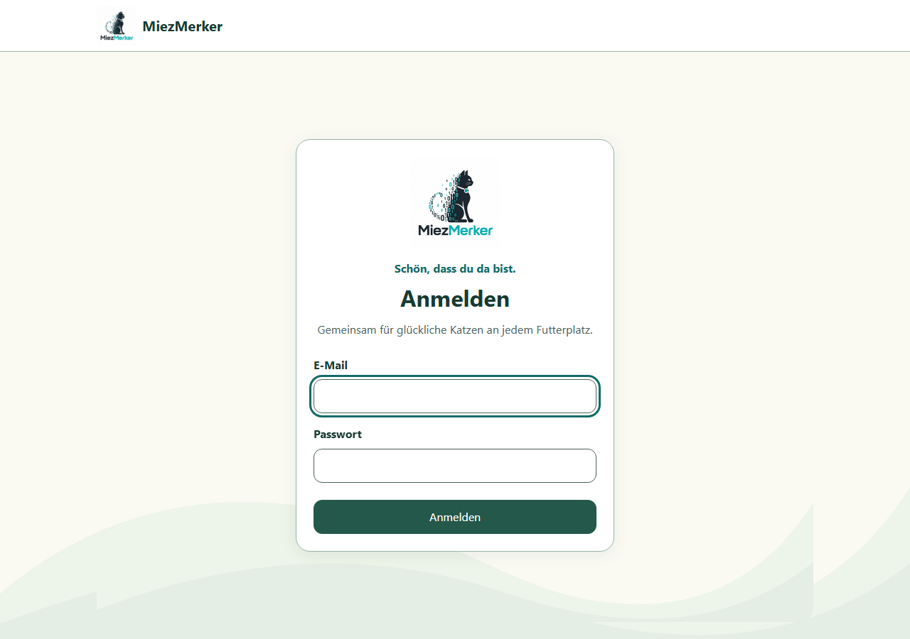

# Login redesign (#48)

The login uses the Round 2 cream, green and turquoise tokens, a centered rounded
card, welcoming copy and the existing optimized project logo. The shared shell,
authentication flow and offline gate are unchanged.

## Artwork replacement

`assets.brand.logo` resolves the existing 56.6 kB PNG derived from
`graphics/MiezMerker_logo.png`. `assets.illustrations.loginBackground` initially
reuses the existing 194-byte background SVG and can be mapped independently.
Status graphics use the existing `Status` adapter. Change these central entries
or their files to replace the artwork without changing `LoginView`. The logo
has a reserved square area with `object-fit: contain`; the decorative background
uses `object-fit: cover`. Both remain in the production Workbox precache.

## Verification

- Compact frontend regression: 109 tests passed across `src/platform`,
  `src/App.test.tsx` and `src/ui/ui.test.tsx`.
- Playwright: 11 login tests and 4 existing auth-gate tests passed. Login
  viewports: 320×740, 390×844, 430×932, 768×1024, 1280×900, 844×390 and 390×360.
  Document and main scroll width fit the viewport. Inputs and submit action
  meet 44px touch targets; inputs have at least 16px text.
- Keyboard Tab order, visible focus and Enter submission verified. Loading
  announces status and disables submission. Error feedback is announced and
  associated with the fields; 401, 500 and network failures expose no raw details.
- Successful login opens the existing Home/navigation. Unauthenticated entry,
  logout, session expiration, pending verification and authorized offline-only
  `/sync` behavior remain covered by the existing gate tests.
- TypeScript and production PWA build passed. Text/primary/focus contrast on
  white is at least 6.3:1; input borders use the muted token (6.8:1).
- Mobile and desktop screenshots were visually inspected. No new animation;
  shared reduced-motion rules remain effective. The existing dynamic viewport,
  safe-area and `interactive-widget=resizes-content` handling remains in use.

## Design deviations and limits

The mockup is a direction reference: this login uses the actual project logo and
lightweight wave background instead of recreating its cat/foliage illustration.
The existing brand header remains. No registration or password-reset controls
were added. Generic server/login rejection guidance is intentional: the current
auth interface does not distinguish credential rejection from server failures.

The 390×360 test exercises reduced viewport scrolling, not a real OS keyboard.
Physical Android/iOS keyboard and installed-PWA interaction still warrant device
smoke testing. Browser accessibility assertions verify semantics and focus;
there was no manual screen-reader session.
