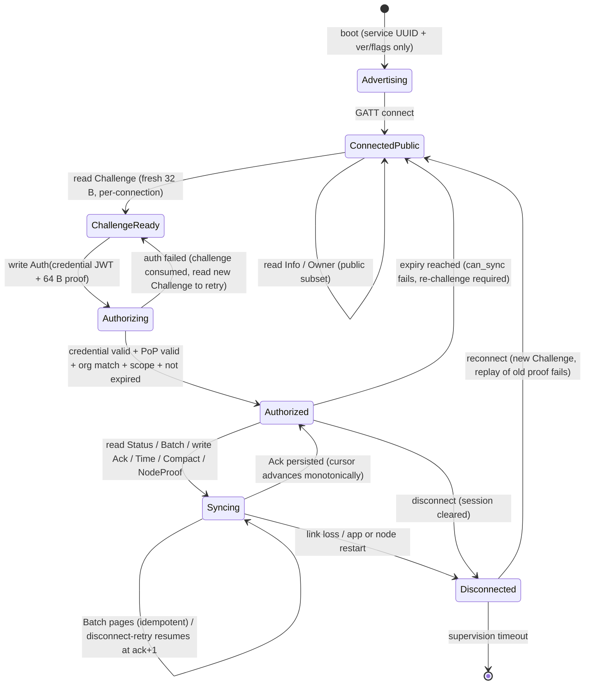

# BLE sync v1 — state diagram

## Connection lifecycle

1. **Advertising** — technical discovery only (ver/flags, no chip/pending/org).
2. **ConnectedPublic** — any peer may read `Info` (version/caps/node/incarnation/
   fw/claim/clock, **no pending**) and `Owner` (claimed org hint or unclaimed
   marker). No observations, chip IDs or pending counts are exposed here.
3. **ChallengeReady** — client reads 32 B nonce. One connection owns one
   `OfflineAuthSession`; `begin` replaces the challenge and clears
   authorization; every `authorize` attempt consumes the nonce, including
   failed attempts (replay of an old challenge always fails).
4. **Authorizing** — client writes `AuthRequest{credential, proof}` where
   `proof = ECDSA P-256/SHA-256(raw challenge)` with the AppDevice private key
   bound in the credential. Node verifies backend signature, `org` binding,
   `role`, `scope=node:sync`, `iat/exp` against a **trusted clock** (never a
   PWA-supplied clock), then proof-of-possession and key fingerprint.
5. **Authorized** — `can_sync(trusted_utc)` gates `Status/Batch/Ack/Time/
   Compact/NodeProof`. Expiry is re-checked on every protected op, including
   long connections. Missing time (`0`) fails closed.
6. **Syncing** — paginated `Batch` from a cursor (`ack+1` after reconnect),
   durable PWA persistence **before** `Ack(high_watermark)`, explicit
   `Compact` to free the acked prefix. All retransmissions are idempotent.
7. **Disconnected** — link teardown calls `disconnect()` (clears pending +
   authorization). Retry uses a fresh challenge; lost ACKs and duplicate
   batches are normal cases, not errors.

## Foreign organization

A credential whose `org` differs from the node's claimed org fails
authorization with `FORBIDDEN_FOREIGN`. The client stays on the public subset
and may only display the `Owner` hint (`organizationId/slug/name/contact`).
It learns nothing about observations, chips or pending counts — not even
whether any exist.

## Claim interplay (#18)

- `UNCLAIMED` nodes expose `claim_state=UNCLAIMED` and empty owner fields.
  Claiming uses the separate claim flow (physical claim mode + signed claim
  advertisement + backend receipt); sync `Batch/Ack/Time` stay unavailable
  until claimed (server returns `INVALID_STATE` if called early).
- `CLAIMED` nodes expose the backend-provisioned owner hint publicly and
  require same-org credentials for everything else.
- Node authenticity (`NodeProof`) is available after authorization: the PWA
  supplies a fresh 32 B nonce, the node signs
  `MM-NODE-SESSION-v1\n{node_id}\n{base64url_nonce}` with its device key. The
  PWA verifies against the backend-pinned node key with a 30 s single-use
  window (see ADR-0013). A fake node without the device key fails here.

## Abort points (all must be lossless)

- Before first transfer: nothing ACKed, node retains all, PWA has no partial
  batch to persist.
- Mid-batch: PWA discards the incomplete page (or keeps only fully received
  records durably), resumes at the last contiguous watermark.
- After durable persist, before ACK: PWA replays the same batch idempotently
  after restart; node re-serves identical bytes.
- Lost ACK: node watermark unchanged; PWA recomputes the same watermark and
  re-sends; node ACK is idempotent for the same value.
- Node restart mid-sync: durable log + watermark survive; challenge/session
  is fresh, client re-challenges and resumes at `ack+1`.
- App restart mid-sync: Dexie/IndexedDB durable store + outbox survive;
  engine reloads watermark and resumes without duplicates.
